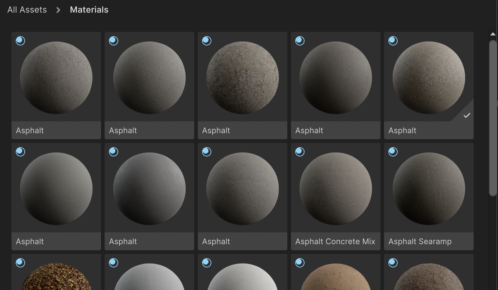

# Browse Unity Cloud assets from the Editor

> **Important**: Before you get started with the package, make sure you meet the [prerequisites](prerequisites.md).

## Browse assets overview
1. Select a project
2. Browse all assets
3. Filter by collections
4. Breadcrumbs navigation
4. Asset tiles
5. Asset details

### Select a project
To select a project, click on the project selector and choose the project you want to browse assets from.

### Browse all assets
To browse all assets, click on the `All Assets` section. Only a section of the assets will be loaded at a time. To load more assets, scroll down to the bottom of the list and more assets will start loading.
Assets are in alphabetical order.

### Filter by collections
You can filter assets by collections by clicking on the collection you want to browse. Only a section of the assets will be loaded at a time. To load more assets, scroll down to the bottom of the list and more assets will start loading.
Assets are in alphabetical order.

### Breadcrumb navigation

When selecting collection filters, Breadcrumbs will be added to provide another indication of where the current asset results are in.
Clicking on any of the breadcrumbs will change the category filters to the breadcrumb value that was interacted with.

### Asset tiles
You can see the following information about an asset in the asset tile:
* Asset name
* Asset thumbnail
* Asset type
* Imported status

Right-clicking on an asset in the panel will show contextual actions for the hovered element. Current implemented actions are:
1. Import: Import the asset into the project by downloading the files into your project in a default location.
   3. It will be disabled if the selected item is already being imported.
2. Re-import: Re-download the files in your project at the default location.
2. Remove From Project: Remove the imported asset files from your project.

### Asset details
To see more details about an asset, click on the asset tile. You will see details around the asset, including:
* Asset name
* Asset thumbnail
* Asset type
* Imported status
* Asset size
* Asset description
* Tags
* Number of files
* Asset files
* Upload Date
* Edited Date
* Version