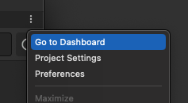

# Context Menu Links

The Asset Manager for Unity package contains links to the **Dashboard, Project Settings, and Preferences** in the window context menu. These can be found by clinking on the three vertical dots located in the upper right corner of the package.

