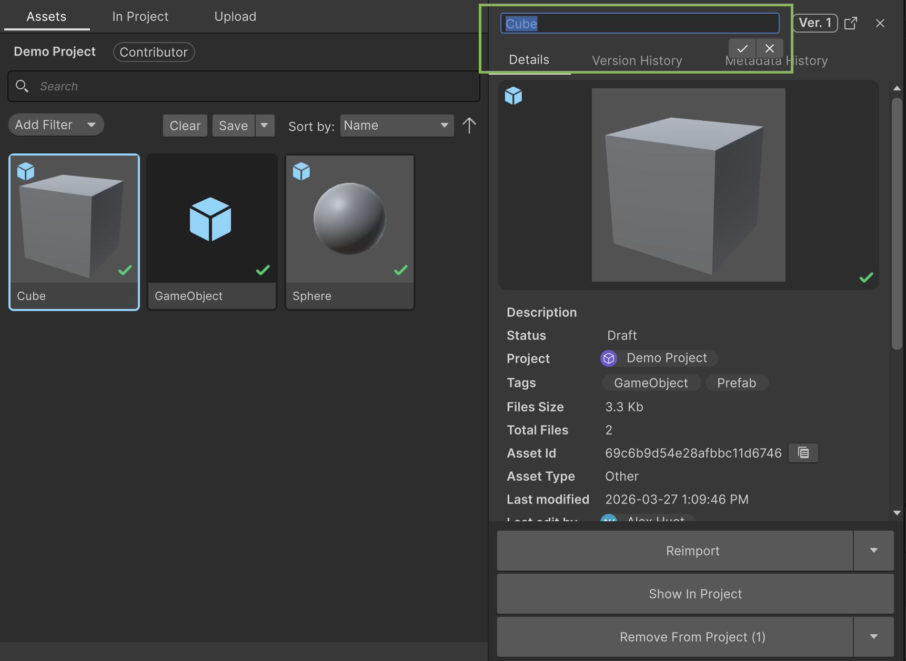
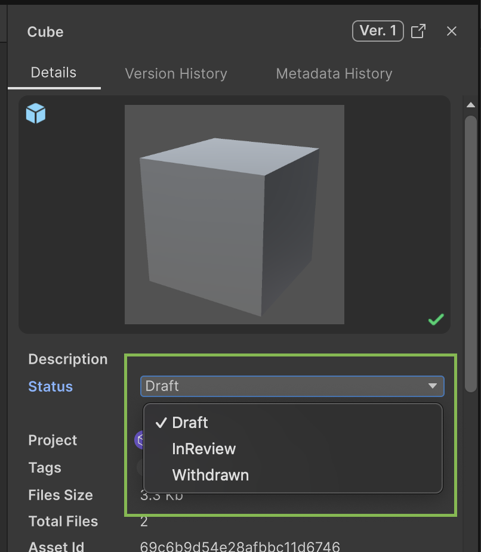
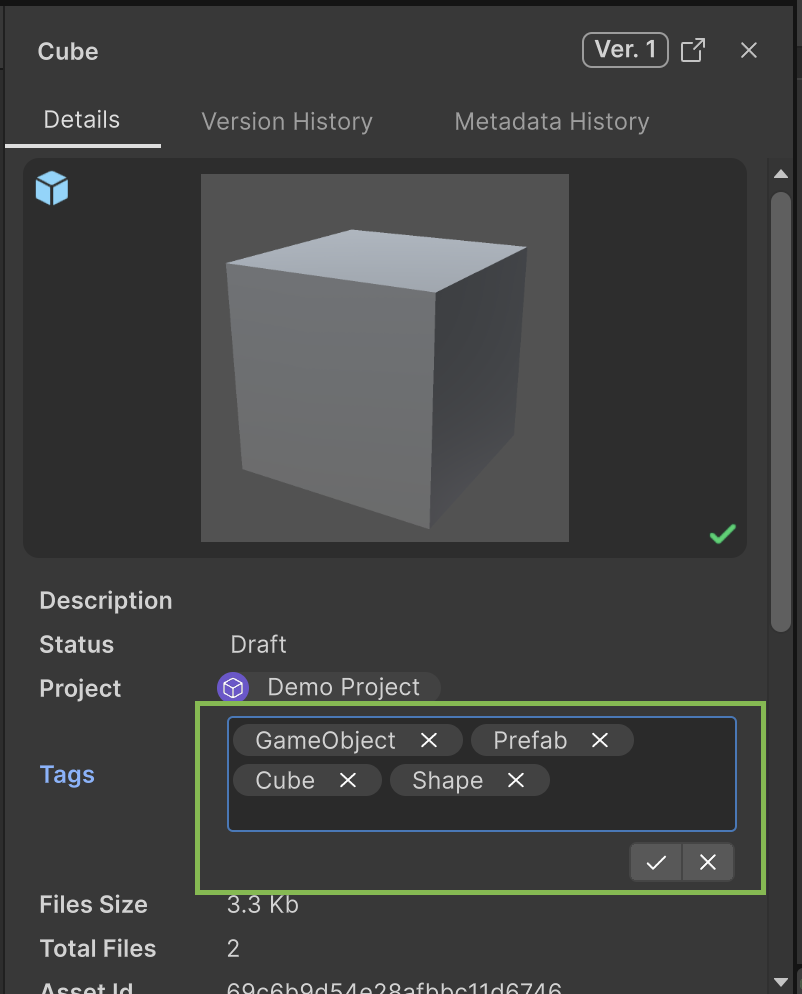
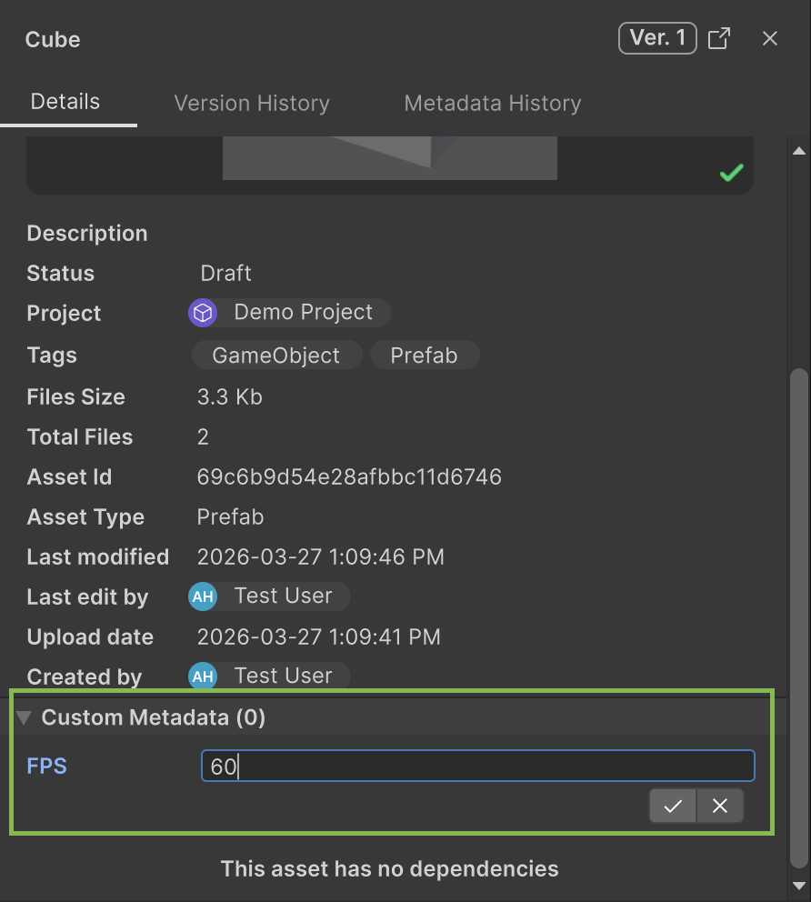
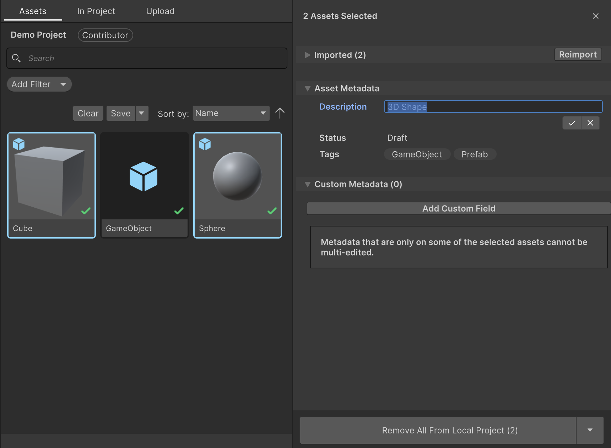
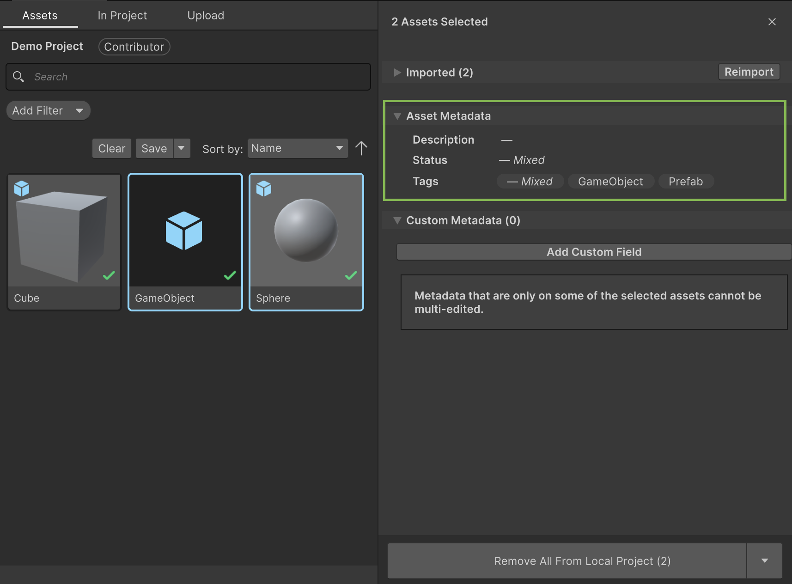
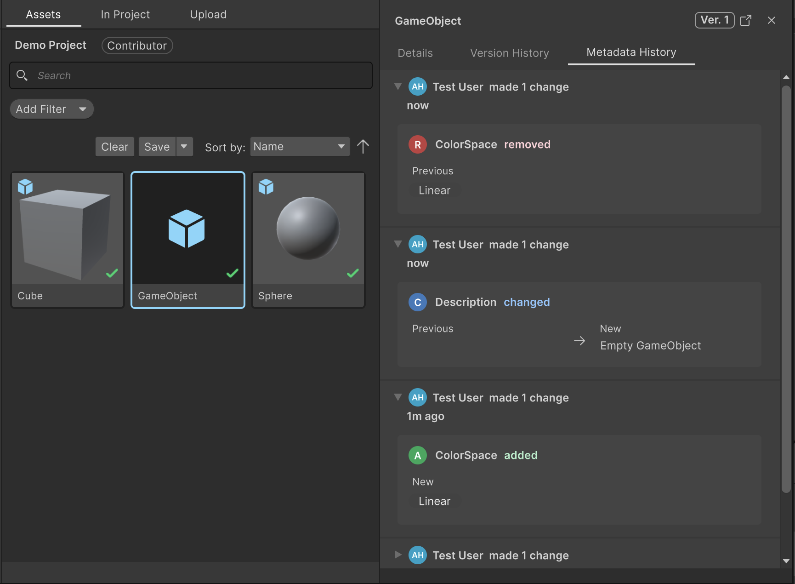

# Edit asset metadata

### Edit asset metadata directly in the Unity Editor.

---

Use the Asset Manager for Unity package to edit asset metadata without leaving the Unity Editor. You can edit the following metadata for single assets or for multiple assets simultaneously:

- Name
- Description
- Status
- Tags
- Custom Metadata fields

## Prerequisites

Before you start, make sure you meet the following prerequisite: 

- You must have at least the Contributor role or higher. Refer to [Verify Asset Manager role](prerequisites.md#verify-asset-manager-role).
- All assets that you want to edit simultaneously must belong to the same project. If you select assets from different projects, editing is disabled.

## Edit single asset metadata

To edit metadata for a single asset:

1. In the Asset Manager for Unity window, select an asset. The Asset Manager Inspector opens.
2. In the Asset Manager Inspector, select any editable field, such as, **Name**, **Description**, **Status**, **Tags**, or **Custom Metadata**. The confirmation controls appear below the field.
3. Update the field.
4. To save your changes, select the confirm button, or press **Enter** or **Return**.
5. To cancel your changes, select the cancel button or press **Escape**.

### Field types

The following field types are available for editing:

#### Name

Enter the asset's display name in this text field.

#### Description

Enter detailed information about the asset in this multi-line text field.

#### Status

Select value from the dropdown menu. The dropdown menu shows available status transitions based on the asset's status flow. You can only transition to statuses defined in the flow. For more information, refer to the **Status editing requirements** section.

#### Tags

Use the tag picker to manage tags. The tag picker displays the asset's current tags. 
- To add a tag, type the tag name and press **Enter**. 
- To remove a tag, select **x** next to the tag name.

#### Custom Metadata

Custom metadata fields appear below the standard fields. The available fields and their types depend on your organization's configuration. Supported field types include:

- **Text**: Single-line or multi-line text input
- **Number**: Numeric values
- **Boolean**: True/false checkbox
- **Timestamp**: Date and time picker
- **URL**: Web address input
- **User**: User selector from your organization
- **Single Selection**: Dropdown menu with predefined options
- **Multi Selection**: Checkbox list with predefined options

> **Note**:
> Create custom metadata fields in the Asset Manager web application first. For more information, refer to [Manage custom metadata for assets](https://docs.unity.com/cloud/en-us/asset-manager/manage-custom-metadata).

## Edit multiple assets

To edit metadata for multiple assets:

1. In the Asset Manager for Unity window, select multiple assets. To select multiple assets, press **Shift** and select the assets you want. The Asset Manager Inspector displays the common metadata for all selected assets.
2. Select any editable field. The confirmation controls appear below the field. 
3. Update the field.
5. Select the confirm button or press **Enter** to apply the changes to all selected assets.

> **Note**:
> When you edit multiple assets:
> - Changes apply to all selected assets simultaneously.
> - The save operation runs in parallel for all assets.
> - If some assets fail to save, a partial failure message identifies which assets saved successfully and which failed. You can retry the operation for failed assets or edit them individually.

### Mixed value indicators

When selected assets have different values for a field, Asset Manager displays a mixed value indicator:

- **Description field**: Displays "—" when values differ.
- **Tags field**: Displays common tags across all assets, plus a "— Mixed" chip if some assets have additional tags.

When you edit a field with mixed values:

- For text fields such as **Name**, **Description**, the new value replaces all existing values.
- For Tags, you can add tags to all assets or remove common tags from all assets. The "— Mixed" chip indicates additional tags that exist on some assets only.

## Status editing requirements

Status editing has special requirements due to status flows.

### Single asset status

You can only transition an asset to a status defined in the asset's status flow. The **Status** dropdown displays only the available transitions from the current status.

### Multiple asset status

To edit the status of multiple assets simultaneously, all selected assets must meet these requirements:

- Use the same status flow
- Have the same current status

If these conditions are not met, the **Status** field appears as read-only with a message that explains why editing is disabled.

> **Note**:
> Status flows define the valid transitions between statuses. For example, a "Draft → Review → Approved" flow only allows transitions from Draft to Review, or from Review to Approved. You can't skip steps or transition backward unless the flow allows it.

## Custom metadata requirements

Custom metadata editing has the following requirements:

### Field availability

A custom metadata field is editable only if it exists in all selected assets. If a field exists only in some assets, it won't appear in the Asset Manager Inspector for multi-asset editing.

### Add custom fields

To add a custom metadata field to assets:

1. In the Asset Manager Inspector, locate the **Custom Metadata** section.
2. Select **Add Custom Field**.
3. Select a field from the dropdown menu. The field appears for all selected assets.

> **Note**:
> **Partial metadata warning**
> When you edit multiple assets, if a custom metadata field exists on only some selected assets, you can't edit it until you add it to all selected assets.

## View Metadata Edit History

The **Metadata History** tab displays changes made to an asset, including the user, change details, and timestamp. You can use the **Metadata History** tab to:

- Track asset metadata changes over time
- Identify who modified fields
- Audit metadata changes for compliance or review

To view an asset's edit history:

1. Select an asset in the Asset Manager for Unity window. The Asset Manager Inspector opens.
2. In the Asset Manager Inspector, select the **Metadata History** tab. The tab displays recent changes to the asset's metadata.

### Metadata History tab features

The **Metadata History** tab includes the following features:

- **Change entries**: Each entry displays the user who made the change, the timestamp, and a summary of the change.
- **Expandable diffs**: Select a change entry to expand it and display field-by-field differences.
- **Pagination**: The tab initially displays 50 history entries. Select **Load more** to view additional entries.

> **Note**:
>You can't start another edit while a save operation is in progress. Wait for the current save to complete before making another edit.

## Troubleshooting

### Can't select a field to edit

If you can't select a field, check the following:

- **Role permissions**: Verify that you have the Contributor role or higher.
- **Mixed projects**: Ensure all selected assets are from the same project.
- **Save in progress**: Wait for any active saves to complete.
- **Field availability**: For custom metadata, ensure the field exists in all selected assets.

### Status field is read-only

If the **Status** field is read-only when editing multiple assets, check the following:

- Verify all selected assets use the same status flow.
- Verify all selected assets have the same current status.
- If conditions are not met, edit assets individually or select assets with matching status flows and current statuses.

### Custom metadata field missing

If a custom metadata field doesn't appear while editing multiple assets, check the following:

- The field must exist in all selected assets.

If the field doesn't exist in some assets:
- Use the **Add Custom Field** menu to add the field to assets that don't have it.
- Or you can edit assets individually to add the field.

### Changes aren't saved

If your changes fail to save, check the following:

- **Network connection**: Check your internet connection.
- **Asset deleted**: The asset is deleted from the cloud. Check the **In Project** tab for errors.
- **Conflict**: Another user may have modified the asset simultaneously. Refresh and apply changes again.
- **Permissions**: Verify you still have the Contributor role for the asset's project.

