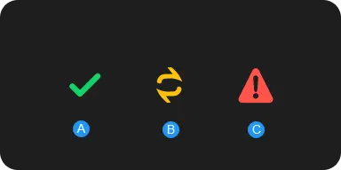

# Import assets from Asset Manager

### How to import assets from Asset Manager into the Unity Editor.

---

> **Note**:
> To modify the Asset Manager Editor preferences for importing assets, see [User Preferences](preferences.md).

## Import your first asset

To import a cloud asset into your Unity Editor project, follow these steps:

1. In the Asset Manager for Unity window, go to the left side bar, select the Organization you want to work in using the top dropdown menu
2. Once your chosen organization is loaded, do one of the following:
    - To view assets in all projects, select **All Assets**. All assets in the organization appear.
    - To view assets in a specific project, select the project that you want from the list. All assets in the project appear.
3. Select the asset that you want. To select multiple assets, press **Shift** and select the assets. On the right side, the Asset Manager Inspector appears.
4. Go to the bottom right corner of the Asset Manager Inspector, select **Import**.

> **Tip**:
After you import an asset, you can move the files to another destination folder.

> **Note**:
If the asset has optimized and converted files, they're imported along with the source files. For more information, see [Optimize and Convert](https://docs.unity.com/cloud/en-us/asset-manager/optimize-and-convert).
After import, you can upload the transformed files only as new assets. You can't re-upload them to the original asset.

> **Note**:
Asset Manager for Unity will persist the tracking information of the imported and uploaded assets under `{Project Folder}/ProjectSettings/Packages/com.unity.asset-manager-for-unity/`. If the project is under source control, it is recommended to have the content of this folder also under source control. This will ensure anyone getting the project will also have the same Asset Manager for Unity tracking information. 

> **Note**:
It is important to have the correct role to correctly import and modify assets with Asset Manager. See the [Verify Asset Manager role](prerequisites.md#verify-asset-manager-role)

## Browse imported assets

To browse imported asset, select the **In Project** tab at the top of the Asset Manager for Unity window.

## Reimport an asset

You can reimport assets to get the latest version of the files uploaded to the asset. To reimport, follow these steps:

1. Select the imported asset you want. On the right side, the Asset Manager Inspector appears.
2. Go to the bottom right corner of the Asset Manager Inspector and select **Reimport**. The Reimport dialog appears.
3. Select **Reimport** for the files you want to reimport, or select **Skip** to ignore reimporting files.
4. Click the **Import** button.

You can also update all imported assets by following these steps:

1. Go to the **In Project** tab.
2. Click the **Update All** button.
3. Select **Reimport** for the files you want to reimport, or select **Skip** to ignore reimporting files.
4. Click the **Import** button.

You can do the same with assets from a specific project or collection by following these steps:

1. Select the desired project or collection in the **Projects** sidebar.
2. In the main window, right-click on an asset without selecting any beforehand to update all assets, or select any number of assets and right-click on one of them to update the selection only.
3. Select the **Update All To Latest** or **Update Selected To Latest** option.
4. Select **Reimport** for the files you want to reimport, or select **Skip** to ignore reimporting files.
5. Click the **Import** button.

> **Note**:
If you move your files into a different destination folder, they will still be updated when you use the Reimport feature.

## Remove an imported asset

If you no longer want to use an imported cloud asset, you can remove it from your project. To remove imported cloud assets, you can either:

1. Select the imported asset you want. On the right side, the Asset Manager Inspector appears.
2. Go to the bottom right corner of the Asset Manager Inspector and select **Remove From Project**.

## Find imported asset location in project

You can find out the project folder location of an imported cloud asset. To locate your asset folder, follow these steps:

1. Select the imported asset you want. On the right side, the Asset Manager Inspector appears.
2. Below the Details section, select the **Included Files** dropdown button. The drop-down list displays files.
3. Select the three-dots icon.
4. Select **Show in project**.

## Refresh for updates

You can refresh the Asset Manager for Unity window to get the latest asset content and published updates. To refresh, you can:

1. Go to the top right corner, select the three-dots icon. A dropdown menu appears.
2. Select **Refresh**.

## Asset import states

Asset import states feature helps you to identify the import status of each asset that you've imported from Unity Cloud into your Editor project.

### Check asset import state

In the bottom right corner of an asset card, you can identify the asset state icon. This icon represents the asset's import status. The following are the different types of import states available in Asset Manager for unity:

- A: Asset has been successfully imported and is the latest version.
- B: Asset has been successfully imported, however, the version is outdated.
- C: Asset has been successfully imported, however, an error has occurred. The following can be some of the reasons for the error:
    - There are missing asset dependencies.
    - The asset was deleted from cloud.
    - You've lost access to the asset.

