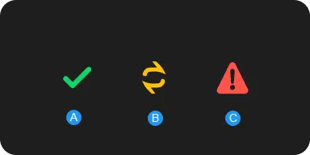

# Import assets from Asset Manager

### How to import assets from Asset Manager into the Unity Editor.

---

## Prerequisites

Before you import, browse, or find assets, make sure you meet the following prerequisites:

 - You have the proper role to import and modify assets. Refer to [Verify Asset Manager role](prerequisites.md#verify-asset-manager-role).
 - You have set the **Import Settings** to import assets to the correct location. The **Import Settings** are in the User Preferences window. This window includes other import, reimport, and upload settings that you might want to modify. Refer to [User Preferences](preferences.md).

## Import your first asset

To import a cloud asset into your Unity Editor project, follow these steps:

1. In the Asset Manager for Unity window, select the organization from the **Organization** dropdown menu.
2. After the selected organization loads, do one of the following:
    - To display assets in all projects, select **All Assets** from the project list. All assets associated with the organization appear.
    - To display assets in a specific project, select the project from the project list.
3. Select one or more cloud assets to import. 
   When you select at least one asset, the Asset Manager Inspector displays. To select multiple assets, press **Shift** and click to add the asset to the selection. Press **Shift** and click a selected asset to remove it from the selection.
4. Select **Import** in the Asset Manager Inspector.

After you import an asset, you can move its uploaded files to another destination folder. If you move an asset within the project, tracking files are automatically relocated to match, preserving the link to the cloud asset.

If the asset has optimized and converted files, these files import with the asset's source files. 
After import, you can upload the transformed files only as new assets. You can't re-upload transformed files to the original asset. For more information, refer to [Optimize and Convert](https://docs.unity.com/cloud/en-us/asset-manager/optimize-and-convert).

> **Note**:  
> Asset Manager for Unity stores tracking information in your project folder. It's recommended that you add this tracking information to source control. Refer to [Tracking Files](tracking-files.md).

## Browse imported assets

To browse an imported asset, select **In Project** in the Asset Manager for Unity window.

## Reimport an asset

Reimport an asset to retrieve the latest version of the asset and its associated files. You can reimport a single asset and its files, all imported assets, or assets from a specific project or collection.

To reimport, follow these steps:

1. Select the imported asset you want to reimport.
2. In the Asset Manager Inspector, select **Reimport**. The Reimport dialog appears.
3. Select **Reimport** for the files you want to reimport, or select **Skip** to ignore files.
4. Click **Import**.

To reimport all imported assets, follow these steps:

1. Select the **In Project** tab.
2. Click **Update All**.
3. Select **Reimport** for the files you want to reimport, or select **Skip** to ignore reimporting files.
4. Click **Import**.

To reimport assets from a specific project or collection, follow these steps:

1. Select the project or collection in the **Projects** sidebar.
2. Do one of the following:
    - With no assets selected, right-click on an asset to reimport all assets
    - Select one or more assets and right-click on one to reimport only the selected assets.
3. Select the **Update All To Latest** or **Update Selected To Latest** option.
4. Select **Reimport** for the files you want to reimport, or select **Skip** to ignore reimporting files.
5. Click **Import**.

> **Note**:
> Reimport updates associated files regardless if you have moved them to a different location after they were first imported.

The Reimport dialog might indicate that some files are tracked by another asset and that tracking information will be overridden. This means that some files are shared with another imported asset. For more information, refer to [When multiple assets use the same files (overlapping imports)](tracking-files.md#when-multiple-assets-use-the-same-files-overlapping-imports).

## Remove an imported asset

If you no longer want to use an imported cloud asset, you can remove it from your project. To remove an imported cloud asset, follow these steps:

1. Select the imported asset you want to remove.
2. In the Asset Manager Inspector, select **Remove From Project**.

If the Asset Inspector displays a warning that some files are tracked by another asset (overlapping imports), removing one of these assets might delete shared files. For more information, refer to [When multiple assets use the same files (overlapping imports)](tracking-files.md#when-multiple-assets-use-the-same-files-overlapping-imports).

## Find an imported asset

To find the location of an imported cloud asset, follow these steps:

1. Select the imported asset you want to find.
2. In the Asset Manager Inspector, select the **Included Files** dropdown. The dropdown list displays all included files.
3. Open the **More** (⋮) menu.
4. Select **Show in project**.

## Refresh for updates

You can refresh the Asset Manager for Unity window to refresh the asset content and published dates. To refresh, follow these steps:

1. In the Asset Manager window, open the **More** (⋮) menu.
2. Select **Refresh** from the dropdown menu.

## Asset import states

Use Asset import states to identify the import status of the assets that you have imported from Unity Cloud into your Unity Editor project.

### Asset import state icons

Each asset card includes an icon that indicates the import status of the asset. Asset Manager for Unity provides the following asset import state icons:

- A: Asset has been successfully imported and it's the latest version.
- B: Asset has been successfully imported but it's an outdated version.
- C: Asset has been successfully imported but an error has occurred. Some reasons for the error are as follows:
    - The asset's dependencies are missing.
    - The asset is no longer on Unity Cloud.
    - You no longer have access to the asset.

## User interface caches

Asset Manager for Unity stores local caches for asset metadata, thumbnails, and textures to improve interface performance when you browse assets. These caches are as follows:

- **Asset metadata** includes data such as names, descriptions, and status. Asset Manager caches asset metadata in your project's `Library/` folder at `Library/com.unity.asset-manager-for-unity/AssetDataCache/`. Because this cache resides in the `Library/` folder, the cache isn't committed to version control.
- Asset Manager caches **Thumbnails and textures** at the location set in [User Preferences](preferences.md).

Asset Manager rebuilds these caches as needed. For example, after a fresh clone or after you clear the Library folder.

> **Note**:
> If you're working offline, asset details might be incomplete or missing. For example, thumbnails might not display and some metadata fields might be unavailable. The Asset Manager repopulates the cache automatically the next time you're online and browse your assets.

