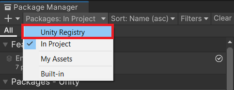
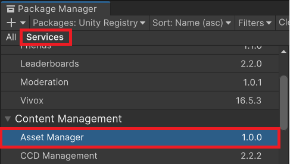
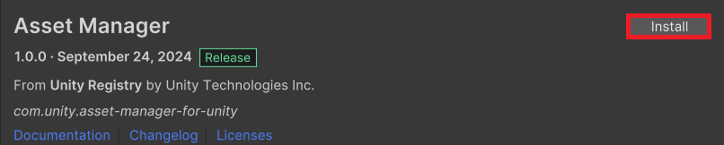
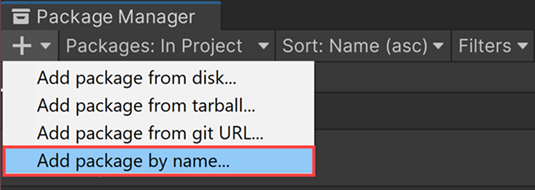

# Package Installation

### Instructions on how to install Asset Manager for Unity package.

---

> **Important**: Before you install the package, make sure you meet the [Prerequisites](prerequisites.md).

To install the Asset Manager for Unity package in Unity Editor version 2022.3.51f1, 6000.0.23f1 and later versions, follow these steps:

1. Open Unity Hub.
2. Sign in with your Unity ID.
3. Open a project in the Editor.
4. Go to the top left menu bar, select **Window** > **Package Manager**. The Package Manager window opens.
5. Go to the top left corner, select the **Packages: In Project** button. A dropdown menu appears.

6. Select **Unity Registry**.
7. Go under the **Services** tab, scroll down and select **Asset Manager** under **Content Management**.

8. Click the **Install** button in the top right corner. After the installation is completed, Asset Manager for Unity package details will appear on the right panel.

To install the Asset Manager for Unity package in older versions of the Editor, follow these steps:

1. Open Unity Hub.
2. Sign in with your Unity ID.
3. Open a project in a supported Editor version (22LTS or 23LTS).
4. Go to the top left menu bar, select **Window** > **Package Manager**. The Package Manager window opens.
5. Go to the top left corner, select the **Add (+)** button. A dropdown menu appears.

   

6. Select **Add package by name**. Name and Version (optional) fields appear.
7. In the **Name** field, enter **com.unity.asset-manager-for-unity**.
8. Select **Add**. After the download is completed, Asset Manager for Unity package details will appear on the right panel.

To open the Asset Manager for Unity window, go to the top left menu bar, select **Window** > **Asset Manager**.
