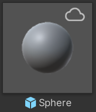
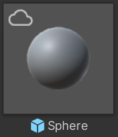
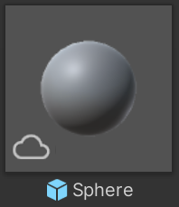
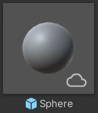
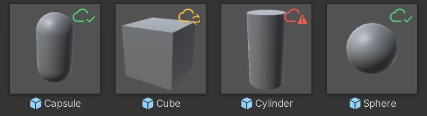

# User Preferences

### Managing Asset Manager Editor Preferences.

---

## How do I change the Asset Manager Editor preferences?

To change the Asset Manager Editor preferences, follow these steps:

1. In the Unity Editor, go to the main menu and select **Edit** > **Preferences** (macOS: **Unity** > **Settings...**).
2. In the **Preferences** window, select **Asset Manager**.

## Import Settings

### Default import location

It's the folder where the Asset Manager stores imported assets. By default, this is the **Assets** folder in your project. You can change this to any folder in your project.

### Create subfolder on import

When enabled, the Asset Manager creates a subfolder in the default import location named after the asset.

### Avoid rolling back versions of dependencies

When enabled, the Asset Manager doesn't roll back versions of dependencies when importing an asset. This is useful if you want to maintain the current version of a dependency in your project.

### Disable the reimport modal

When enabled, the Asset Manager doesn't display the reimport dialog during asset imports. This is useful if you want to import assets without being prompted for confirmation.

> **Important**:
> The reimport modal can only be disabled if the **Avoid rolling back versions of dependencies** option is enabled.

> **Note**:
> If you disable the reimport modal, you won't be able to select which files to reimport. The Asset Manager automatically replaces all files of the assets being imported.

## Cache Settings

### Cache location

It's the folder where the Asset Manager stores cached assets. By default, this is the default **Unity/cache** folder found within your user profile. You can change this to any folder on your machine.

### Maximum cache size

It's the maximum amount of disk space the Asset Manager uses to store cached assets. By default, this is set to 2 GB. You can change set it to any value between 2 GB and 200 GB.

## Upload Settings

### Generate tags automatically based on preview image

When enabled, the Asset Manager automatically generates AI tags for assets based on the preview image.

### Confidence level for automatic tag generation

It's the minimum confidence level that the Asset Manager uses to generate tags for assets based on the preview image. By default, this is set to 80%. You can change this to any value between 0 and 100.

### Pin Dependencies to 'Latest' Version Label During Upload

When enabled, the dependencies of an uploaded asset point to the version with the **Latest** version label. When disabled, the uploaded asset points to fixed versions of its dependencies.

### Allow individual dependency version selection during upload

When enabled, you will be able to select the version or the version label of each dependency when uploading an asset. This allows for more granular control over which versions of dependencies are used in the uploaded asset.

> **Note**:
> This setting only applies when the Dependencies upload option is set to Separate. If Embedded or Ignore is selected, this setting has no effect.

## Project Window Settings

### Enable Icon Overlay in Project Window

When enabled, any asset that has been imported from the Asset Manager will display an overlay status icon indicating this in the Project Window.  

> **Note**:
> This overlay icon feature only works when assets are displayed as tiles, not as list items.

### Icon Overlay Position

Sets the corner of the asset icon in which to display the overlay icon.  

### Display Detailed Overlay Icon

Sets whether to display the detailed status in the overlay icon, specifically the exact import status of the asset.
- Imported and up-to-date: green cloud
- Out-of-date relative to the cloud: yellow cloud
- Asset has been deleted on the cloud: red cloud

If detailed display is disabled, assets connected to the Asset Manager will simply display a gray cloud icon regardless of their specific status.  

## Debug Settings

### Enable Debug Logs

When enabled, Asset Manager for Unity will increase the number of logs displayed in the console. This can be useful in order to debug unexpected results.
