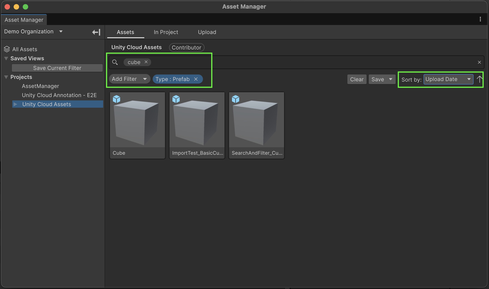
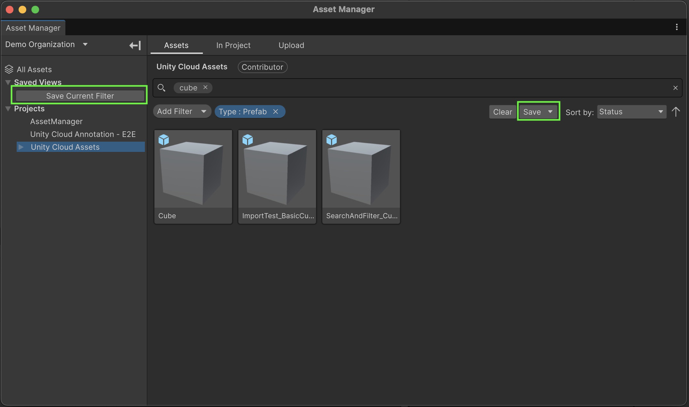
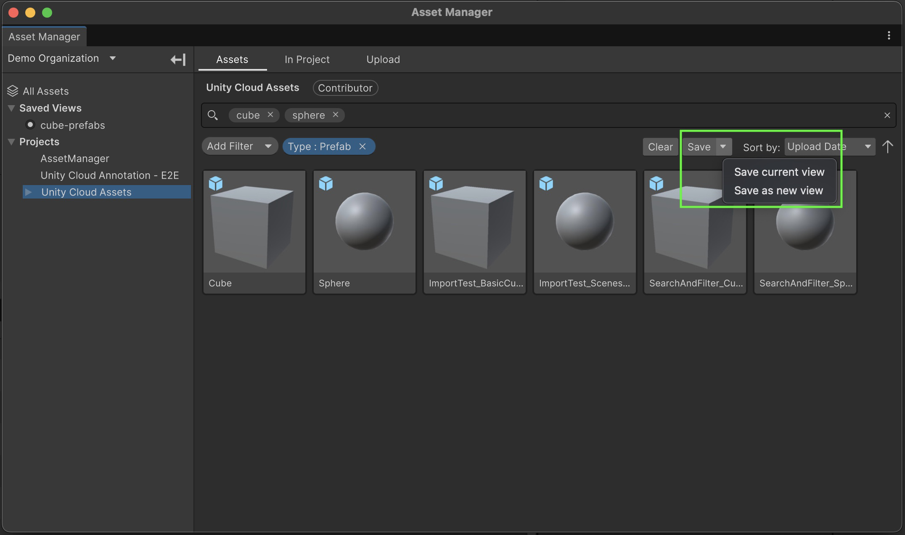
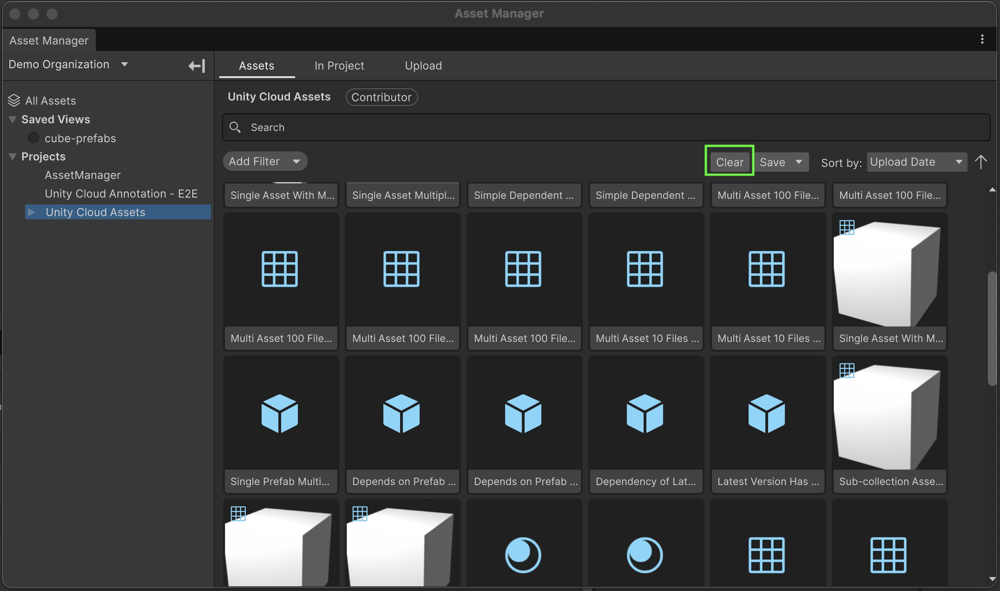
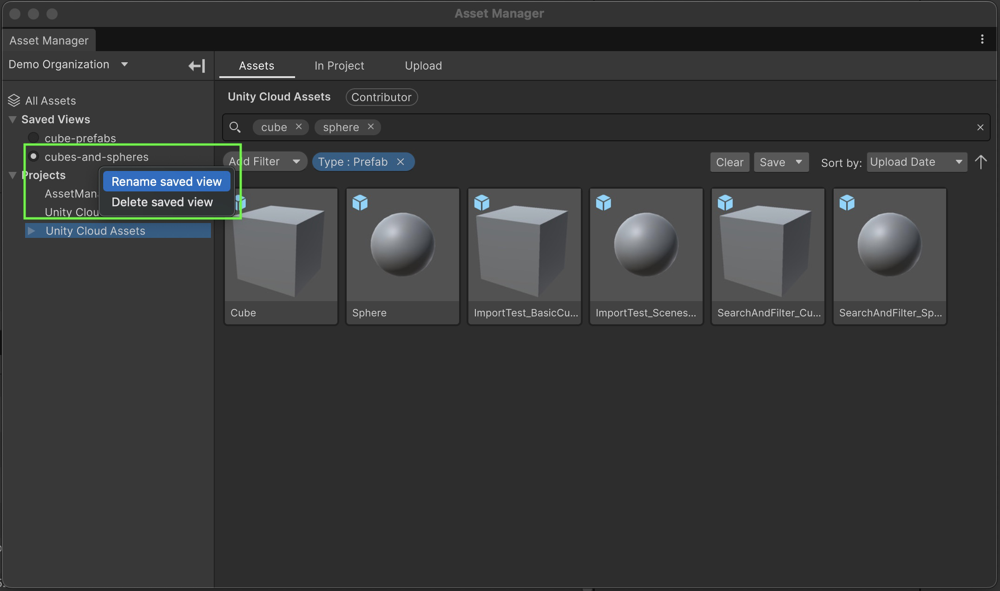
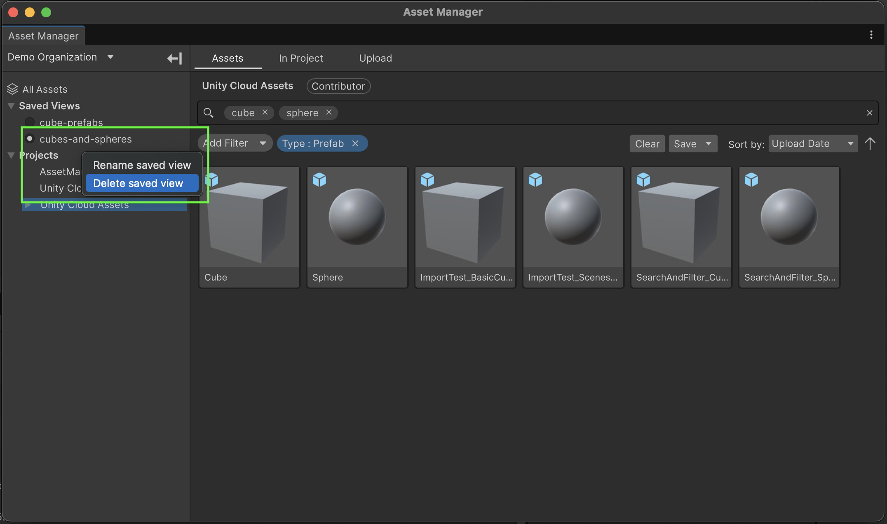

# Saved Views in the Asset Manager Window

### How to save search filters as views

---

## Saving a view

Saved views allow you to store a search filter to your project. To save a view, first populate your search filter with any or all of the following fields:
- Search terms in the search bar
- Search filters
- Sorting options
 

> **Note**:
> Saved views are only applicable in the **Assets** tab of the Asset Manager Window.

### Saving your first view
Once you have a search filter that you would like to save, you can save the view in one of two ways:
1. If you have no existing saved views, you can use the save button present in the **Saved Views** section in the side bar. Note: this button only appears when no views have been saved.
2. Clicking on the **Save** button under the search bar
 

 
Saving a view will automatically prompt you to name the view in the sidebar.

### Saving the current view vs saving as a new view
With a saved view selected, clicking on the **Save** button will save the selected view with the current search filter, overwriting the previously saved filter. If you wish to save the current filter as a new view, you can click on the dropdown arrow on the **Save** button to view more save options, and select the **Save as new view** option.
 

## Apply and clear your views

You can apply a chosen view by selecting it in the sidebar under the **Saved Views** section. This will automatically apply the saved view's search filter to your window. The applied search filter will persist if you change selected project or collection in the sidebar.
 
To clear a saved view or the current search filter, you have two options:
1. Click on the applied saved view in the sidebar to de-select it and clear the search filter
2. Click on the **Clear** button under the search bar
 

## Renaming a view
If you want to rename a saved view, right-click on the view you wish to rename in the sidebar and select **Rename saved view**.
 

 

> **Note**:
> You cannot have two views with the same name. If you attempt to rename a view with a duplicate name, the renaming will not be applied and a warning will be logged to the console.

## Deleting a view
If you want to delete a saved view, right-click on the view you wish to delete in the sidebar and select **Delete saved view**.
 

 

## Committing saved views to your Version Control System
Your saved view data is saved to the settings file of your project found under `<Your Unity Project Path>/ProjectSettings/Packages/com.unity.asset-manager-for-unity/Settings.json`. If you wish to commit your saved views to your version control system, this is the file that should be committed.

