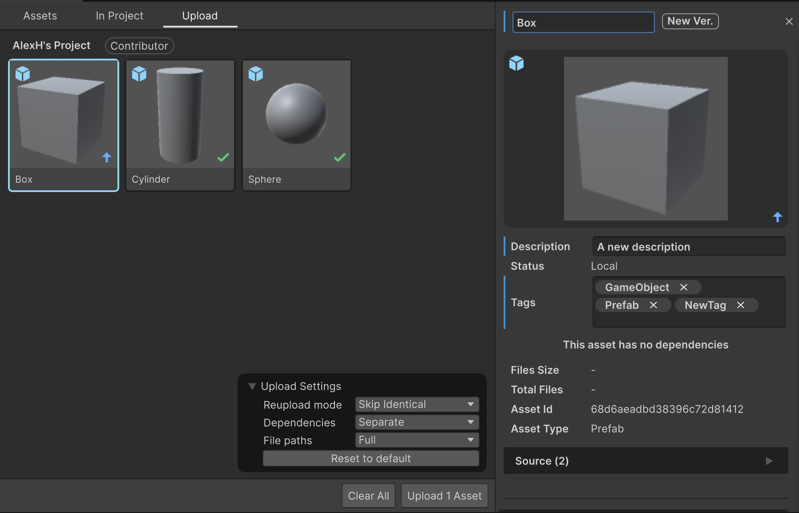
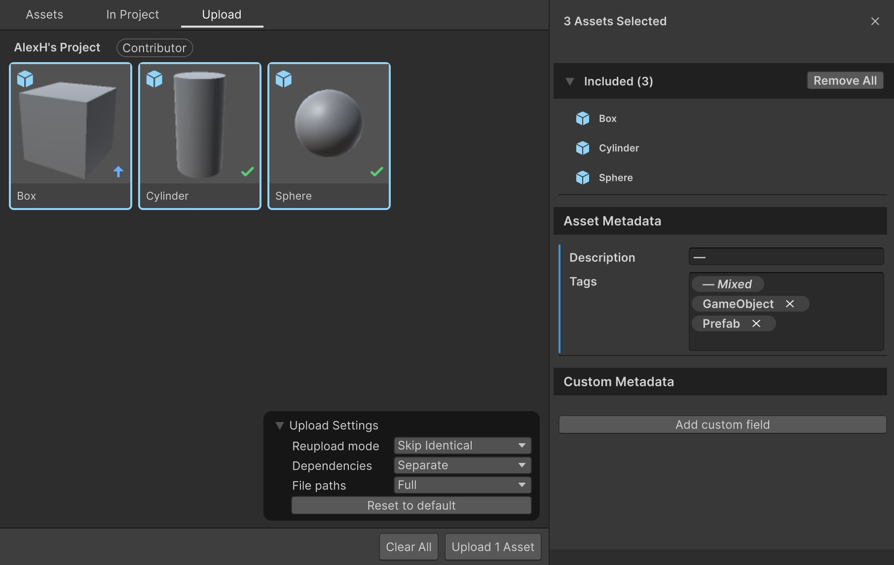
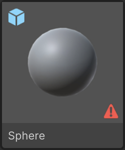
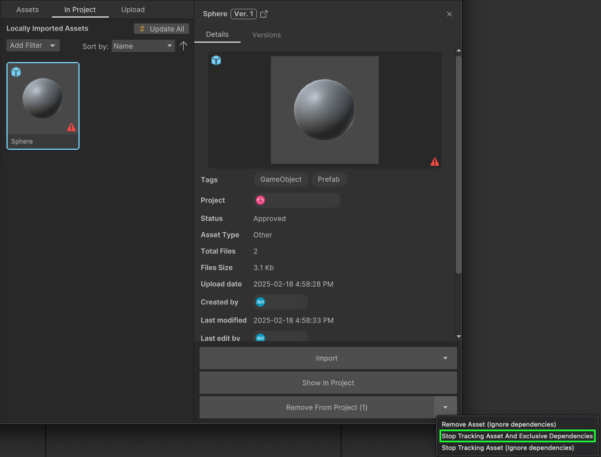

# Upload assets to Asset Manager

### How to upload assets to Asset Manager from the Unity Editor.

---

The Asset Manager for Unity package enables you to upload assets to Asset Manager. You can use this feature to:

- Upload all related asset files and their dependencies to preserve the assets’ data integrity.
- Share and reuse your game ready assets between different Unity projects and team members. This helps you reduce the cost of asset creation for your project and get the maximum value for an asset.
- Easily manage asset dependencies between Unity editor and Unity Cloud.

> **Important**:
Before you upload assets to Asset Manager, make sure you meet the [Prerequisites](prerequisites.md).

> **Important**:
Ensure that all upload operations are completed before triggering a domain reload (like entering playmode).

> **Note**:
> To modify the Asset Manager Editor preferences for uploading assets, see [User Preferences](preferences.md).

## Upload assets to Cloud

To upload your assets from your local project in the Unity Editor to the Asset Manager, follow these steps:

1. Open the Unity Editor.
2. Go to the Project window, select the assets you want to upload.
3. Right-click and select **Upload to Asset Manager** or drag and drop from Project Window to Asset Manager.
4. Go to the left navigation bar. Select the organization and project you want to upload the assets to from the dropdown list.
5. You can also select the [collection](https://docs.unity.com/cloud/en-us/asset-manager/basic-concepts#collections) you want to upload your asset to. See the **Create a Collection** section for instructions on how to create a collection.
6. In the bottom right corner, you will find the **Upload Settings** window where you can choose one of the following options for the **Reupload mode** setting:
   - **Skip Identical:** Skip assets that are already uploaded to the Asset Manager.
     - **Force New Version:** Create a new version for existing assets with updated versions.
     - **Force New Asset:** Create copies of the assets in Asset Manager.
7. In the same window, you can manage the way dependencies are uploaded by selecting one of the following options for the **Dependencies** setting:
    - **Ignore:** To ignore dependencies.
    - **Separate:** To upload dependencies as separate cloud assets.
    - **Embedded:** To upload dependencies together with the main asset as a single asset.
      > **Warning**: The option to embed dependencies is being deprecated and will be removed in a future version.
8. In the same window, you can manage the way paths are displayed by selecting one of the following options for the **File paths** setting:
   - **Full:** Keeps the path relative to the project Assets folder.
   - **Compact:** Reduces files nesting by removing common path parts.
   - **Flatten:** Flatten all files to the root of the asset and rename them in case of collision.
9. You can edit the assets' metadata fields such as **Name**, **Description**, and **Tags**
    - Select the asset to display an inspector showing the default data.
    - Select any editable field and enter your modifications. Press return/enter or exit focus of the field to set the change. The changes will only be applied once they are uploaded.
    - Any edited fields will be indicated by a blue border appearing to the left of the field.   
    - You can also multi-select assets and bulk edit their fields.   
      - For the **Description** field, if the selected assets do not have identical descriptions, an "—" symbol will be displayed.
      - For the **Tags** field, only the tags common across all assets will be displayed for edit. You can remove any of these tags for all selected assets by clicking the "x", or add new ones by typing them in. If any tags exist that are not assigned to all assets, a "— Mixed" tag will appear to indicate this case.
10. You can select an asset and in the upload metadata select any existing custom metadata fields in your organization for 1 or multiple assets at the time. If you want to add a new custom metadata on all the selected assets, it will be possible only if that custom metadata is not present in any selected assets, and the value will be set the same for every assets.
If you enabled `Allow individual dependency version selection during upload` in the preferences, you can also select the version or version label of each dependency in the **Dependencies** section of the asset.
> **Note**:
    The custom metadata fields need to be created on the web application first. See the [Manage custom metadata for assets](https://docs.unity.com/cloud/en-us/asset-manager/manage-custom-metadata) for more details on how to create them.
11. Select **Upload assets**.

> **Note**:
Check the asset import states to know the current import and version status of the asset. For more information on asset import states, see Asset import states.

> **Note**:
For more details on the identified local changes, you can hover over the state icon on the asset's thumbnail.

> **Note**:
You can check the version and status of each dependency at upload time by looking at the items under the **Dependencies** foldout of the **Asset Details Page**.

## Create a Collection

To create a collection in a project, follow these steps:

1. Right-click on the project that you want to create a collection for.
2. Select the **Create new collection** option.
3. Enter a name for your new collection.
4. Press the "Enter" key or click away to confirm your selection

You can then rename and delete your collection by right-clicking it and selecting the desired action.

## Troubleshooting

### Re-uploading assets to the cloud creates duplicates instead of updating the existing asset

If you are experiencing a situation in which re-uploading assets to the cloud creates duplicates instead of updating the existing asset, this could be the result of tracking assets in your local Unity project which have been deleted from the cloud. Below are example actions which could lead to this situation:
  - If the asset is deleted from the cloud, the locally tracked asset will remain in your project and display a warning icon in the `In Project` tab. 
  - If you attempt to re-upload this asset, it will create a new instance of the asset in the cloud as opposed to a new version of the asset. In other words this asset is separate from the originally deleted asset.
  - It can occur at this point that if you then attempt to re-upload this asset, it will continue to create new instances of the asset in the cloud instead of updating the existing asset.

**Solution**: Ensure that you untrack all assets locally which were tracking the deleted asset, to ensure no conflicts occur in the re-upload process.
- **Step 1**: Identify the locally tracked assets that correspond to the deleted cloud assets via the warning icons in the `In Project` tab in the Asset Manager for Unity window .
- **Step 2**: Untrack these assets locally by selecting the `Stop Tracking Asset and Exclusive Dependencies` option. 

At this point, future re-uploads of the asset should correctly update the existing asset in the cloud.
