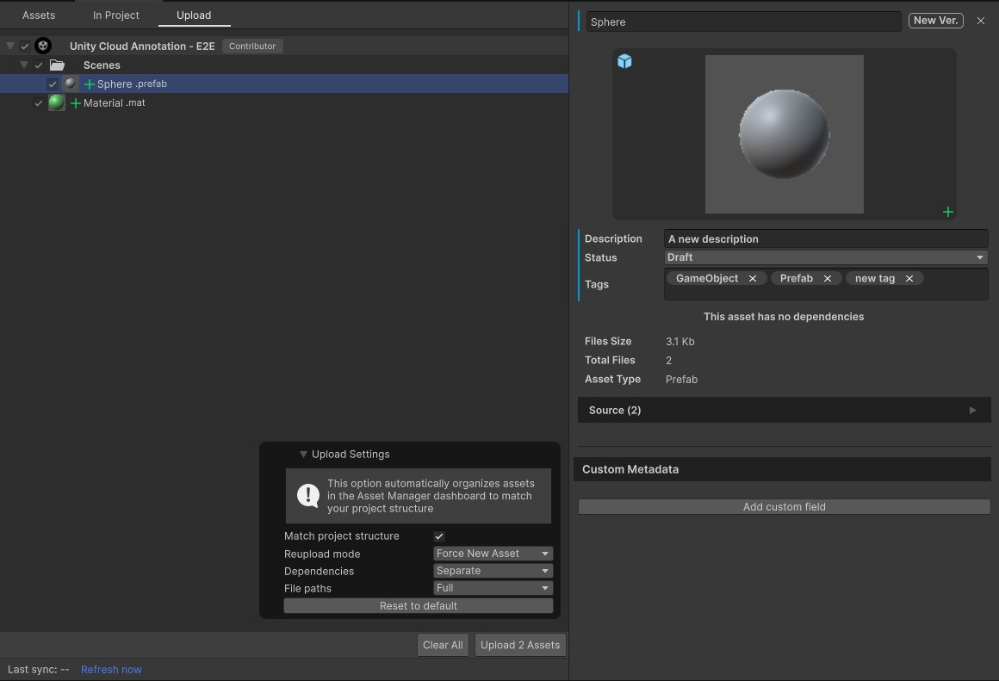
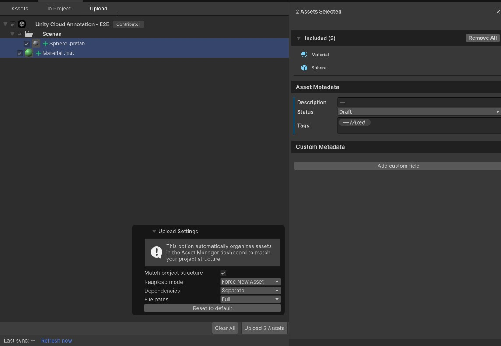
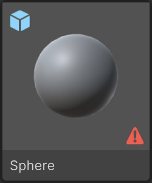
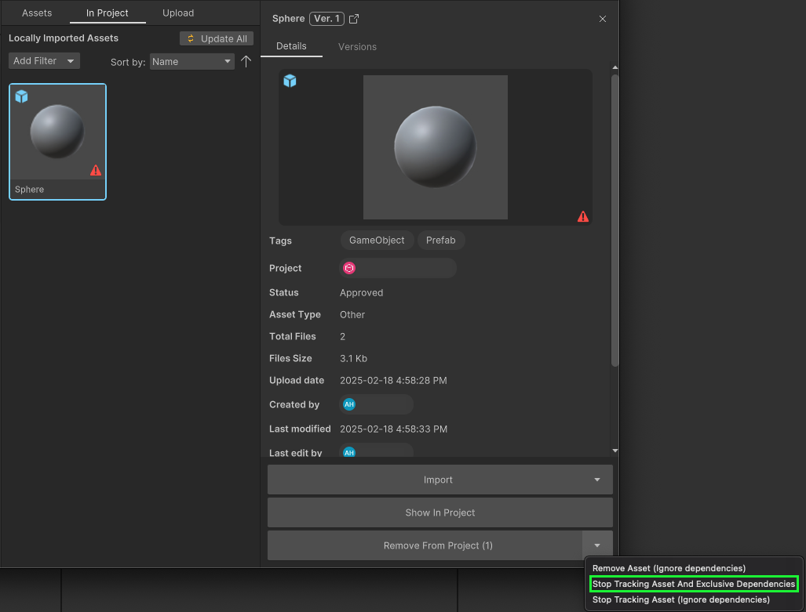

# Upload assets to Asset Manager

### Upload assets to Asset Manager from the Unity Editor.

---

Use the Asset Manager for Unity package to upload assets to Asset Manager. You can use this feature to:

- Upload all related asset files, and their dependencies, to preserve data integrity.
- Manage asset dependencies between the Unity Editor and Unity Cloud.
- Share and reuse your assets between different Unity projects. Sharing assets helps you reduce asset creation costs by getting the maximum value for each asset.

## Prerequisites
Before you upload assets to Asset Manager, make sure you meet the [Prerequisites](prerequisites.md).

> **Important**: Ensure that all upload operations complete before triggering a domain reload, such as entering playmode.

> **Note**:
> To modify the Asset Manager Editor preferences for uploading assets, refer to [User Preferences](preferences.md).

## Upload assets to Cloud

To upload your assets from your local project in the Unity Editor to the Asset Manager, follow these steps:

1. Open the Unity Editor.
2. In the Project window, select the assets you want to upload.
3. Right-click and select **Upload to Asset Manager** or drag from the Project window to Asset Manager.
4. Go to the left navigation bar. Select the organization and project or [collection](https://docs.unity.com/cloud/en-us/asset-manager/basic-concepts#collections) that you want to upload the assets to from the dropdown list. For more information on creating a new collection, refer to [Create a Collection](create-collection.md).
5. In the Upload Settings window, configure **Match project structure**,**Reupload mode**, **Dependencies**, and **File path** settings for your upload. For more information, refer to [Upload settings panel](upload-settings.md). 
6. You can edit the assets' metadata fields such as **Name**, **Description**, and **Tags**. 
   - Select the asset to display an inspector showing the default data.
   - Select any editable field and enter your modifications. Press return/enter or exit focus of the field to set the change. The changes will only be applied once they are uploaded.
   - Any edited fields will be indicated by a blue border appearing to the left of the field.   
   - You can also multi-select assets and bulk edit their fields.   
   - For the **Description** field, if the selected assets do not have identical descriptions, an "—" symbol will be displayed.
   - For the **Tags** field, only the tags common across all assets will be displayed for edit. You can remove any of these tags for all selected assets by clicking the "x", or add new ones by typing them in. If any tags exist that are not assigned to all assets, a "— Mixed" tag will appear to indicate this case.
7. You can select an asset and in the upload metadata select any existing custom metadata fields in your organization for 1 or multiple assets at the time. If you want to add a new custom metadata on all the selected assets, it will be possible only if that custom metadata is not present in any selected assets, and the value will be set the same for every assets.
   If you enabled `Allow individual dependency version selection during upload` in the preferences, you can also select the version or version label of each dependency in the **Dependencies** section of the asset.
   > **Note**:
   The custom metadata fields need to be created on the web application first. For details, refer to the [Manage custom metadata for assets](https://docs.unity.com/cloud/en-us/asset-manager/manage-custom-metadata).
8. Select **Upload assets**.

> **Note**:
Check the asset import states to know the current import and version status of the asset. For more information on asset import states, refer to Asset import states.

> **Note**:
> When you upload assets that are already imported in your project, Asset Manager uses [tracking files](tracking-files.md) to link local files to their cloud counterparts. This is how the package determines whether to create a new asset or update an existing one.

> **Note**:
For more details on the identified local changes, you can hover over the state icon on the asset's thumbnail.

> **Note**:
You can check the version and status of each dependency at upload time by looking at the items under the **Dependencies** foldout of the **Asset Details Page**.

## Limitations

### Dependencies outside the Assets folder

You can only upload asset dependencies inside your project's `Assets/` folder. If an asset references dependencies outside the `Assets/` folder, the assets are uploaded but the dependencies aren't. For example, if you upload an asset that references a texture in the `Packages/` folder, the asset is uploaded without the texture. 

If you upload assets that reference external dependencies, make sure the destination project also includes the required dependencies and packages. This ensures the assets will function correctly when reimported.

## Troubleshooting

### Re-uploading assets to the cloud creates duplicates instead of updating the existing asset

If you are experiencing a situation in which re-uploading assets to the cloud creates duplicates instead of updating the existing asset, this could be the result of tracking assets in your local Unity project which have been deleted from the cloud. Below are example actions which could lead to this situation:
  - If the asset is deleted from the cloud, the locally tracked asset will remain in your project and display a warning icon in the **In Project** tab. 
  - If you attempt to re-upload this asset, it will create a new instance of the asset in the cloud as opposed to a new version of the asset. In other words this asset is separate from the originally deleted asset.
  - It can occur at this point that if you then attempt to re-upload this asset, it will continue to create new instances of the asset in the cloud instead of updating the existing asset.

**Solution**: Ensure that you untrack all assets locally which were tracking the deleted asset, to ensure no conflicts occur in the re-upload process.
- **Step 1**: Identify the locally tracked assets that correspond to the deleted cloud assets via the warning icons in the `In Project` tab in the Asset Manager for Unity window .
- **Step 2**: Untrack these assets locally by selecting the `Stop Tracking Asset and Exclusive Dependencies` option. 

At this point, future re-uploads of the asset should correctly update the existing asset in the cloud.
