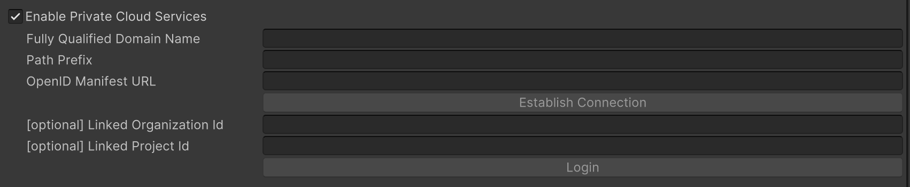

# Private Cloud Guide for Asset Manager for Unity

## How do I connect to a Private Cloud Server?

1. Open **Project Settings** in Unity.
2. Navigate to **Asset Manager**/**Private Cloud Services**.
3. Enable **Private Cloud Services**.   
4. Fill in the settings information:
   - **Fully Qualified Domain Name**: The fully qualified domain name (FQDN) of your private cloud server. This should not include the protocol (e.g., `https://`).
   - **Path Prefix**: An optional path prefix.
   - **OpenID Manifest URL**: The full URL to the public OpenID configuration.
5. Click **Establish Connection** to apply the settings.
6. [Optional] If you have a specific organization identifier and/or project identifier, you can set them in the **Organization Id** and **Project Id** fields. If these fields are left empty, the default organization and project will be populated on login.
7. Click **Login** to authenticate with the private cloud server.
8. Once logged in, you can access the Asset Manager window by going to **Window** > **Asset Manager**.

## How do I disconnect from a Private Cloud Server?

1. Open **Project Settings** in Unity.
2. Navigate to **Asset Manager**/**Private Cloud Services**.
3. Disable **Private Cloud Services** by unchecking the box. This will disconnect you from the private cloud server.
4. Once disconnected, you can access the Asset Manager window by going to **Window** > **Asset Manager**. The Asset Manager will use your Unity Editor account for authentication and will connect to public cloud services.